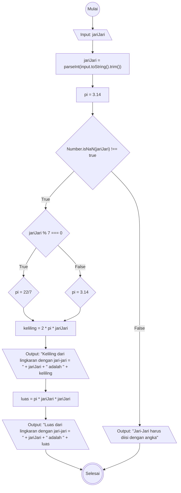

# Flowchart program interaktif untuk menghitung luas dan keliling lingkaran

```mermaid
flowchart TD

start@{"shape": circle, "label": "Mulai"}
input@{"shape": lean-l, "label": "Input: jariJari"}
parseInput@{"shape": rectangle, "label": jariJari = parseInt(input.toString().trim())}
initPi@{"shape": rectangle, "label": "pi = 3.14"}
isjariJariNumber@{"shape": diamond, "label": Number.isNaN(jariJari) !== true}
isjariJariMultiseven@{"shape": diamond, "label": jariJari % 7 === 0}
isjariJariMultisevenTrue@{"shape": diamond, "label": pi = 22/7}
isjariJariMultisevenFalse@{"shape": diamond, "label": pi = 3.14}
isjariJariNumberFalse@{"shape": lean-l, "label": "Output: #quot;Jari-Jari harus diisi dengan angka#quot;"}
circumference@{"shape": rectangle, "label": keliling = 2 * pi * jariJari}
outputCircumference@{"shape": lean-l, "label": "Output: #quot;Keliling dari lingkaran dengan jari-jari = #quot; + jariJari + #quot; adalah #quot; + keliling"}
area@{"shape": rectangle, "label": luas = pi * jariJari * jariJari}
outputArea@{"shape": lean-l, "label": "Output: #quot;Luas dari lingkaran dengan jari-jari = #quot; + jariJari + #quot; adalah #quot; + luas"}
stop@{"shape": dbl-circ, "label": "Selesai"}

start-->input-->parseInput-->initPi-->isjariJariNumber--True-->isjariJariMultiseven--True-->isjariJariMultisevenTrue-->circumference
isjariJariMultiseven--False-->isjariJariMultisevenFalse-->circumference
circumference-->outputCircumference-->area-->outputArea-->stop

isjariJariNumber--False-->isjariJariNumberFalse-->stop
```