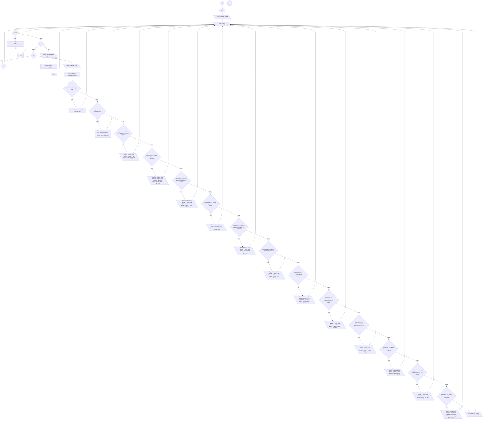

# Flowchart Konversi Suhu

```mermaid
flowchart TD

start@{"shape": circle, "label": "Mulai"}
input@{"shape": lean-l, "label": "Input: input = process.stdin.on(#quot;data#quot;)"}


xZ@{"shape": rectangle, "label": x = 0}
isxZero@{"shape": diamond, "label": x === 0}
isxOne@{"shape": diamond, "label": x === 1}
isxTwo@{"shape": diamond, "label": x === 2}
isxOther@{"shape": diamond, "label": x = 0}
xEqOne@{"shape": rectangle, "label": x = 1}
xEqTwo@{"shape": rectangle, "label": x = 2}

showInputTempText@{"shape": lean-l, "label": "Output: #quot;Masukan angka derajat suhu :#quot;"}
tempEqInput@{"shape": rectangle, "label": temp = parseInt(input.toString().trim())}
showInputTempSourceText@{"shape": lean-l, "label": "Output: #quot;Masukan angka derajat suhu :#quot;"}
tempSourceEqInput@{"shape": rectangle, "label": tempSource = input.toString().trim()}
showInputTempDestinationText@{"shape": lean-l, "label": "Output: #quot;Masukan angka derajat suhu :#quot;"}
tempDestinationEqInput@{"shape": rectangle, "label": tempDestination = input.toString().trim()}

stop@{"shape": dbl-circ, "label": "Selesai"}
isNumberTemp@{"shape": diamond, "label": Number.isNaN(temp) !== true}
isNumberTempFalse@{"shape": rectangle, "label": "Output: #quot;Angka suhu tidak valid coba lagi!#quot;"}

isTempSourceNotEqualTempDestination@{"shape": diamond, "label": tempSource !== tempDestination}
isTempSourceEqualTempDestinationFalse@{"shape": rectangle, "label": "Output: #quot;Satuan unit asal tidak boleh sama dengan satuan unit yang sama dengan satuan unit tujuan#quot;"}


%% from celcius to other

isCelciusToReamur@{"shape": diamond, "label": "tempSource === #quot;celcius#quot; && tempDestination === #quot;reamur#quot;"}
outputCelciusToReamur@{"shape": lean-l, "label":"Output: #quot;Konversi suhu bernilai #quot; + temp + #quot;dari Celcius ke Reamur adalah #quot; + temp *= 4/5"}

isCelciusToFahrenheit@{"shape": diamond, "label": "tempSource === #quot;celcius#quot; && tempDestination === #quot;fahrenheit#quot;"}
outputCelciusToFahrenheit@{"shape": lean-l, "label":"Output: #quot;Konversi suhu bernilai #quot; + temp + #quot;dari Celcius ke Fahrenheit adalah #quot; + temp = temp * 9/5 + 32"}

isCelciusToKelvin@{"shape": diamond, "label": "tempSource === #quot;celcius#quot; && tempDestination === #quot;kelvin#quot;"}
outputCelciusToKelvin@{"shape": lean-l, "label":"Output: #quot;Konversi suhu bernilai #quot; + temp + #quot;dari Celcius ke Fahrenheit adalah #quot; + temp = temp + 273.15"}

%% from Reamur to other

isReamurToCelcius@{"shape": diamond, "label": "tempSource === #quot;reamur#quot; && tempDestination === #quot;celcius#quot;"}
outputReamurToCelcius@{"shape": lean-l, "label":"Output: #quot;Konversi suhu bernilai #quot; + temp + #quot;dari Reamur ke Celcius adalah #quot; + temp *= 5/4"}

isReamurToFahrenheit@{"shape": diamond, "label": "tempSource === #quot;reamur#quot; && tempDestination === #quot;fahrenheit#quot;"}
outputReamurToFahrenheit@{"shape": lean-l, "label":"Output: #quot;Konversi suhu bernilai #quot; + temp + #quot;dari Reamur ke Fahrenheit adalah #quot; + temp = temp * 9/4 + 32"}

isReamurToKelvin@{"shape": diamond, "label": "tempSource === #quot;reamur#quot; && tempDestination === #quot;kelvin#quot;"}
outputReamurToKelvin@{"shape": lean-l, "label":"Output: #quot;Konversi suhu bernilai #quot; + temp + #quot;dari Reamur ke Kelvin adalah #quot; + temp = temp * 5/4 + 273.15"}

%% from Fahrenheit to other

isFahrenheitToCelcius@{"shape": diamond, "label": "tempSource === #quot;Fahrenheit#quot; && tempDestination === #quot;celcius#quot;"}
outputFahrenheitToCelcius@{"shape": lean-l, "label":"Output: #quot;Konversi suhu bernilai #quot; + temp + #quot;dari Fahrenheit ke Celcius adalah #quot; + temp = (temp - 32) * 5/9"}

isFahrenheitToReamur@{"shape": diamond, "label": "tempSource === #quot;Fahrenheit#quot; && tempDestination === #quot;reamur#quot;"}
outputFahrenheitToReamur@{"shape": lean-l, "label":"Output: #quot;Konversi suhu bernilai #quot; + temp + #quot;dari Fahrenheit ke Reamur adalah #quot; + temp = (temp - 32) * 4/9"}

isFahrenheitToKelvin@{"shape": diamond, "label": "tempSource === #quot;Fahrenheit#quot; && tempDestination === #quot;kelvin#quot;"}
outputFahrenheitToKelvin@{"shape": lean-l, "label":"Output: #quot;Konversi suhu bernilai #quot; + temp + #quot;dari Fahrenheit ke Kelvin adalah #quot; + temp = (temp + 459.67) + 5/9"}

%% from Kelvin to other

isKelvinToCelcius@{"shape": diamond, "label": "tempSource === #quot;Kelvin#quot; && tempDestination === #quot;celcius#quot;"}
outputKelvinToCelcius@{"shape": lean-l, "label":"Output: #quot;Konversi suhu bernilai #quot; + temp + #quot;dari Kelvin ke Celcius adalah #quot; + temp = temp - 273.15"}

isKelvinToReamur@{"shape": diamond, "label": "tempSource === #quot;Kelvin#quot; && tempDestination === #quot;reamur#quot;"}
outputKelvinToReamur@{"shape": lean-l, "label":"Output: #quot;Konversi suhu bernilai #quot; + temp + #quot;dari Kelvin ke Reamur adalah #quot; + temp = (temp - 273.15) * 4/5"}

isKelvinToFahrenheit@{"shape": diamond, "label": "tempSource === #quot;Kelvin#quot; && tempDestination === #quot;Fahrenheit#quot;"}
outputKelvinToFahrenheit@{"shape": lean-l, "label":"Output: #quot;Konversi suhu bernilai #quot; + temp + #quot;dari Kelvin ke Fahrenheit adalah #quot; + temp = temp * 9/5 - 459.67"}


%% NaO Not an Option 
outputOtherToOther@{"shape": lean-l, "label": "Output: #quot;Pilihan sumber atau tujuan tidak valid#quot;"}


%% ===================================================
%% xZ
%% isxZero
%% isxOne
%% isxTwo
%% isxOther
%% showInputTempText
%% tempEqInput
%% showInputTempSourceText
%% tempSourceEqInput
%% showInputTempDestinationText
%% tempDestinationEqInput
start-->xZ-->showInputTempText-->input-->isxZero--True-->tempEqInput-->xEqOne-->input
isxZero--False-->isxOne--True-->showInputTempSourceText-->tempSourceEqInput-->xEqTwo-->input
isxOne--False-->isxTwo--True-->showInputTempDestinationText-->tempDestinationEqInput-->isNumberTemp--True-->isTempSourceNotEqualTempDestination--True-->isCelciusToReamur
isxTwo--False-->isxOther-->input
%% Celcius
%% Celcius to Reamur
isCelciusToReamur--True-->outputCelciusToReamur-->input

%% Celcius to Fahrenheit
isCelciusToReamur--False-->isCelciusToFahrenheit--True-->outputCelciusToFahrenheit-->input

%% Celcius to Kelvin
isCelciusToFahrenheit--False-->isCelciusToKelvin--True-->outputCelciusToKelvin-->input

%% To Reamur Section 
isCelciusToKelvin--False-->isReamurToCelcius

%% Reamur

%% Reamur to Celcius
isReamurToCelcius--True-->outputReamurToCelcius-->input
isReamurToCelcius--False-->isReamurToFahrenheit

%% Reamur to Fahrenheit
isReamurToFahrenheit--True-->outputReamurToFahrenheit-->input
isReamurToFahrenheit--False-->isReamurToKelvin

%% Reamur to Kelvin
isReamurToKelvin--True-->outputReamurToKelvin-->input

%% To Fahrenheit Section 
isReamurToKelvin--False-->isFahrenheitToCelcius

%% Fahrenheit

%% Fahrenheit to Celcius
isFahrenheitToCelcius--True-->outputFahrenheitToCelcius-->input
isFahrenheitToCelcius--False-->isFahrenheitToReamur

%% Fahrenheit to Reamur
isFahrenheitToReamur--True-->outputFahrenheitToReamur-->input
isFahrenheitToReamur--False-->isFahrenheitToKelvin

%% Fahrenheit to Kelvin
isFahrenheitToKelvin--True-->outputFahrenheitToKelvin-->input

%% To Kelvin Section 
isFahrenheitToKelvin--False-->isKelvinToCelcius

%% Kelvin

%% Kelvin to Celcius
isKelvinToCelcius--True-->outputKelvinToCelcius-->input
isKelvinToCelcius--False-->isKelvinToReamur

%% Kelvin to Reamur
isKelvinToReamur--True-->outputKelvinToReamur-->input
isKelvinToReamur--False-->isKelvinToFahrenheit

%% Kelvin to Fahrenheit
isKelvinToFahrenheit--True-->outputKelvinToFahrenheit-->input

%% Not an Option nice try
isKelvinToFahrenheit--False-->outputOtherToOther-->input

isNumberTemp--False-->isNumberTempFalse-->input
isTempSourceNotEqualTempDestination--False-->isTempSourceEqualTempDestinationFalse-->input
```